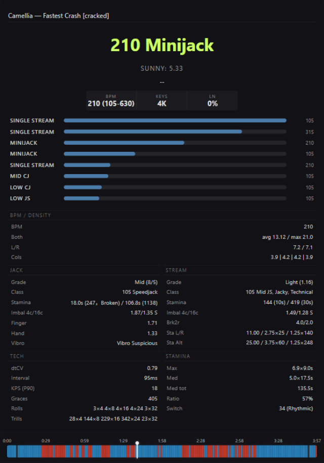

# osumania-estimator v4.3.0

A tosu overlay plugin for osu!mania 4K key pattern analysis and difficulty estimation.

By Akuta Zehy.

## Deployment

Copy the entire `osumania-estimator by Akuta Zehy` folder into tosu's `static/` directory. Restart tosu or reload overlays.

## Interface

### View Mode (Settings)

Configured via tosu settings panel. `settings.json` provides two toggles and a panel mode:

| Setting           | Description                                             |
| ----------------- | ------------------------------------------------------- |
| Show Pattern Breakdown | Toggle the key-type/pattern bars row              |
| Show Custom Metrics    | Toggle density, jack, stream, tech, stamina, LN panels  |
| Panel Mode             | `Analysis` keeps the full breakdown; `Scores` shows the headline modules and the Akuta skillset bars |

### Detailed View (card — lobby/result screen)

Rendered with the actual beatmap `Camellia - Fastest Crash (inteliser) [cracked]`:



### Scores View (Panel Mode → Scores)

Headline modules, the Akuta skillset bars (Stream, Jumpstream, Handstream, Stamina, Jack Speed, Jack Chord, Jack Tech, Chordjack, Technical, LN Coordination), and the section timeline preview:

![Scores view card — Akuta skillset bars for Camellia - Fastest Crash [cracked]](docs/screenshot-scores.png)

### Element Descriptions

#### Main Display (top line)

Shows the effective BPM and dominant key type from grid analysis (e.g. `160 Mid Jumpstream`). When the LN ratio is ≥15%, the dominant LN pool type replaces the key type. On vibro maps whose verdict is `vibro`, the key type is replaced by "Vibro" in red. Independently of both, when the G-estimate classifier (density-map based) puts tech as the top type, the title becomes `Burst Tech` (tech·jack) or `Reading Tech` (tech·speed/stamina). BPM is `rawBPM * division / 4 * speedRate`. For SV maps with multiple BPM zones, per-cell active timing point lookup provides accurate BPM per segment.

#### Dan Estimate (bottom line)

`【Type】Reform N dan tier (value)` — the Akuta RC estimate reformatted through the G-estimate type adjuster (jack/speed/stamina/tech nudges ±0.2-0.3 dan). LN-dominant charts (ratio >15%) append the separate LN channel estimate. Vibro maps keep the numeric estimate while the vibro badge sits above.

#### Sunny (second line)

Sunny Rework star rating. If the algorithm returns below 0.01, a density-based estimate is shown. When the in-game star (gameStar) is available, a comparison suffix is appended: `Sunny: 4.51 (+12.3%)`.

#### Key-Type / Pattern Bars

Primary (grid analysis available): up to 8 bars of the map's BPM-grouped key types — abbreviated names (`CJ` Chordjack, `JS` Jumpstream, `HS` Handstream), bar width = cell share relative to the largest, with the group's BPM on the right.

Fallback (no grid analysis): up to 4 interlude-cluster bars, bar width = pattern amount / max amount.

#### BPM / DENSITY Panel

| Field | Meaning                                                 |
| ----- | ------------------------------------------------------- |
| BPM   | Speed-adjusted BPM (`rawBPM * speedRate`)               |
| Both  | `avg X / max Y` — both-hands mean and max density (notes per 1000ms window) |
| L/R   | Left vs right hand mean density                         |
| Cols  | Per-column mean density                                 |

#### LONG NOTE Panel

Shown when LN ratio > 1%, or any overlapping LN or Tap LN exists.

| Field   | Meaning                                                                        |
| ------- | ------------------------------------------------------------------------------ |
| Ratio   | `60% (45%)` — all LN / excluding Tap LN. May append ` · Jacky` or ` · Speedy` when jack- or speed-heavy LN constructions dominate |
| Overlap | `585 (12%)` — overlapping LN pairs / % of total LN (sweep-line O(n log n))     |
| Tap LN  | Short LNs (<=16th note)                                                        |
| P-Score | `CO x · DE x · WC x · TE x` — Coordination / Density / Wildcard / Technical pool scores |

Shield, reversed shield, column lock, attack/release, inverse and LN-tree constructions are computed in `lnAnalysis.ts`. Of these, shield, column-lock, inverse, LN-chord heads, tap LN and the release textures feed the pool scores; ouroboros, LN-tree and anti-shield (reversed-shield) counts are computed for the subtype labels but deliberately excluded from the pool formulas.

#### JACK Panel

Rows in order: Grade, Class, Stamina, Imbal 4c/16c, Finger, Hand, Vibro.

| Field   | Meaning                                                                         |
| ------- | ------------------------------------------------------------------------------- |
| Grade   | Grid-note P90 tiers (cell-weighted): Mini (≤4) / Low (≤7) / Mid (≤11) / Dense (≥12). Display: `Mini (P90/P50)` |
| Class   | Run-extraction jack type at the dominant jack cadence: `Actually Not Jack` / `Speedjack` / `Bullet / Minijack` / `{Low\|Mid\|High} Chordjack` / `Anchor / X Chordjack` (anchor confidence ≥70). See [Jack Class System](#jack-class-system-class-row) |
| Stamina | `burstSec（notes[, Broken]） / sumSec（notes）` — longest jack streak and total streak coverage with note counts. `Broken` marks a sub-10s peak pushed past 10s by merging streaks separated by ≤½ measure (gap time not counted) |
| Finger  | Max per-column density / max both-hands (1.0 balanced, >1.5 biased)            |
| Hand    | Max(left,right) peak density / max both-hands (1.0 balanced, >1.5 biased)      |
| Imbal   | 4-row / 16-row window hand imbalance (`4c/16c`). Direction label: L/R/S |
| Vibro   | Vibro verdict + cvRate + burst/control timing. Display: `Vibro(cvRate%) Bx.xs/Cx.xs` |

#### STREAM Panel

Rows in order: Grade, Class, Stamina, Imbal 4c/16c, Brk2r, Sta L/R, Sta Alt.

| Field   | Meaning                                                                 |
| ------- | ----------------------------------------------------------------------- |
| Class   | 切 type at the dominant row cadence: `[eff] [Full\|Dense\|Broken\|Mid] (JS\|HS\|SS)[, Jacky][, Technical]`. Singles tag → `SS`; Full + pure single-note → `Running Man`. See [Stream Class System](#stream-class-system-stream-class-row) |
| Grade   | Mean notes-per-row tiers over qualifying stream segments (gridTotalNotes ≥4): Single (≤1.125) / Light (≤1.25) / Mid (≤1.5) / Dense (<2.0) / Full (=2.0) / Heavy (>2.0). Display: `Mid (1.38)` |
| Stamina | `N (10s) / M (30s)` — max rows in any 10s / 30s sliding window (chords count once) |
| Imbal   | 4-row / 16-row window hand imbalance (`4c/16c`). Direction label: L/R/S |
| Brk2r   | Broken stream: max/median notes in any 2-row window                     |
| Sta L/R | SH (Single Hand) stamina — `P100 / P90=v×n / P50=v×n`                   |
| Sta Alt | DH (Dual Hand) stamina — `P100 / P90=v×n / P50=v×n`                     |

#### TECH Panel

Rows appear only when non-zero, in this order.

| Field    | Meaning                                                            |
| -------- | ------------------------------------------------------------------ |
| dtCV     | Row-interval coefficient of variation in active sections — time-axis regularity: 0.2-0.4 steady (streams/chordjack), 0.6+ bursty tech |
| Interval | Single-finger spacing of the fastest burst (ms, played time)       |
| KPS (P90)| Both-hands P90 keys per second (played time, scales with speedRate)|
| Graces   | Grace/flam count (cell-aware, excludes legitimate 48th-note streams) |
| Rolls    | Max consecutive length per division (e.g. "24x16")                 |
| Trills   | Total count per division                                           |

#### STAMINA Panel

| Field   | Meaning                                      |
| ------- | -------------------------------------------- |
| Max     | P75–P95 density band mean × longest continuous stretch above P75 |
| Med     | P50–P75 density band mean × longest continuous stretch above P50 |
| Med tot | Total time at/above the Med value            |
| Ratio   | Med total time / map duration                |
| Switch  | Max jack/stream transitions in a 16-beat window + descriptor (Steady/Mixed/Rhythmic/Intense) |

The switch metric is computed over uneven rows clustered from actual note timestamps (not a fixed grid); consecutive rows sharing any column count as a jack pair, same-type pairs merge into runs, and the score is the maximum run-type transitions inside a sliding 16-beat window. LN heads participate as single notes at their start time. Descriptors: Steady ≤15, Mixed ≤25, Rhythmic ≤35, Intense >35. Low values = sustained single-mode sections (pure stream/jumpstream/jack); high values = frequent stable switching (minijack-style maps).

## Technical Notes

### Architecture (v4.3.0)

The analysis pipeline is decomposed into focused modules:

```
                             analyzer.ts (pipeline orchestrator)
                             ┌──────────────────────────────────────┐
                             │ parse → Sunny → patterns → grid →    │
                             │   custom → aggregate → section →     │
                             │   Akuta score (msd/ + estimate/)     │
                             └──────┬───────────────┬───────────────┘
                                    │               │
          sectionAnalysis.ts        │    gridAnalysis.ts + grid/   vibroAnalysis.ts
   ┌─────────────────────┐         │   ┌─────────────────────┐   ┌───────────────────┐
   │ Segment slicing     │         │   │ Cell-level subclass │   │ 连4 detection     │
   │ Pattern analysis    │         │   │ Pattern class.      │   │ SHFC classification│
   │ LN subtypes         │         │   │ Jack/stream detect  │   │ canVibro algorithm │
   │ Anomaly detection   │         │   │ LN metrics          │   │ Verdict engine     │
   └─────────────────────┘         │   │ Grace/flam detect   │   └───────────────────┘
                                   │   │ Cross-cell jack     │
                                   │   │ Key type (A4 tiers) │
                                   │   │ Vibro label         │
                                   │   └─────────────────────┘
                                   │
              lnAnalysis.ts        ├── Per-cell timing lookup:
   ┌──────────────────────┐        │   getActiveTimingPoint(time)
   │ LN metrics           │        │   → correct BPM for SV maps
   │ Pool scores (CO/DE/  │        │     with multiple BPM zones
   │   WC/TE)             │        │
   │ Release difficulty   │        └── Grade helpers:
   └──────────────────────┘            gradeJack(), gradeStream()
                                   │
        anchorAnalysis.ts           │
   ┌──────────────────────┐        │
   │ SF/SH/DH stamina     │        │
   │ Bridge/P100 tolerance│        │
   │ Strict P90/P50       │        │
   └──────────────────────┘        │
                                   │
   jackAnalysis.ts                 │    streamAnalysis.ts
   ┌──────────────────────┐        │    ┌──────────────────────┐
   │ Jack-specific metrics│        │    │ Stream classification│
   │ Finger/Hand pressure │        │    │ Grade / Imbalance    │
   │ Hand bias (L/R/S)   │        │    │ Broken stream        │
   └──────────────────────┘        │    │ Hand bias (L/R/S)    │
                                   │    └──────────────────────┘
                                   │
        jackClass.ts                    streamClass.ts
   ┌──────────────────────┐        ┌──────────────────────┐
   │ Jack class typing    │        │ 切 class typing       │
   │ Burst/sum stamina    │        │ 10s/30s peaks        │
   └──────────────────────┘        └──────────────────────┘
                                   │
                          ┌────────┴──────────┐
                          │  customMetrics     │
                          │  (aggregator)      │
                          └───────────────────┘
```

### Division-Based Grid

The map is divided into a beat grid where each cell spans one row (4 notes in 4K). Each cell is classified by:

- **Subdivision**: how many notes per beat (denom 2, 4, 6, 8, 12, etc.)
- **Pattern**: detected via column analysis (jack, chord, trill, roll, etc.)
- **Category**: stream (<=2 cols/row), jack (same-col density), LN, break
- **Effective BPM**: `cellRawBPM * denom / 4 * speedRate`

### Switch Metric (gridSwitch)

The switch metric measures how frequently the map alternates between jack-type and stream-type rows, distinguishing sustained single-mode sections (pure stream / jumpstream) from frequent stable switching (chordjack-style maps).

1. **Uneven rows**: All rice notes (LN heads included as single notes at their start time) are clustered into rows by actual timestamps (≤8ms apart merge into one row) — not a fixed grid.
2. **J/S pairing**: Consecutive rows sharing any column → J (jack), otherwise S (stream). Lenient: single-column jacks and chord overlaps both count.
3. **Runs**: Consecutive same-type pairs merge into runs.
4. **Sliding window**: A 16-beat window (16 × beatLength) slides across the map; `gridSwitch` = max run-type transitions inside any window.

Descriptor thresholds: **Steady** ≤15, **Mixed** ≤25, **Rhythmic** ≤35, **Intense** >35. Displayed in the STAMINA panel as `Switch` (e.g. `54 (Intense)`).

### Jack Class System (Class row)

Run-extraction jack typing at the map's dominant jack cadence (effective BPM). This is the metric surfaced by the JACK panel's `Class` and `Stamina` rows (introduced v4.3, replacing the Purity/Anchor rows).

1. **Segments**: rows rebuilt from all note starts (LN heads included) — not grid cells. Statistics are restricted to the dominant effBPM group plus secondaries holding ≥10% of jack cells.
2. **Link**: two *adjacent* rows (no row in between) sharing a column, spaced ≈ the jack cadence (±18%). Adjacency is what distinguishes a jack from a same-column repeat across a 切 (switch) structure.
3. **Chain**: maximal consecutive links per column form x连 (2连 bullet, 3+, …). Chordjacks with intervening rows are excluded by design (covered by the anchor/both-hands metrics).
4. **Stats** pooled over qualifying clusters: total links, 3+-run and 5+-run key share (`k3`/`k5`), count of 5+ chains (`r5`), key-weighted average run length `Σx²nₓ/Σxnₓ`, and jack run keys per second.
5. **Class decision**:
   - no compliant sections → `Actually Not Jack`
   - streak coverage ≥25% but intensity (keys/s, 10s peak) below threshold → `Speedjack` (fragmented jack grind)
   - anchor confidence (`k5+ key share × avg run depth × 5-run presence` product) ≥70 → `Anchor / X Chordjack`
   - 3+-run key share <15% → `Bullet / Minijack` (2-run dominant)
   - otherwise `{Low|Mid|High} Chordjack` by jack run keys per second (<8 / <15 / ≥15)
6. **Stamina row**: burst = longest single streak; streaks separated by ≤½ measure always merge into groups (gap time not counted) and the max is re-taken — when the merge is what pushes a sub-10s peak past 10s the value is tagged `Broken`. Sum = total streak seconds over unique covered rows plus their note count.

Streak tolerance rules: a single non-jack row transition is tolerated (must be resolved by the next jack transition); two consecutive non-jack transitions, an empty cadence slot, or an off-grid (切键) row break the streak. LN heads participate as plain starts.

### Stream Class System (STREAM Class row)

Interval-distribution typing at the map's dominant row cadence — the 切 (switch) analogue of the jack Class (introduced v4.3, replacing the Type row).

1. **Cadences**: row-interval clusters (greedy ±15%); the dominant cluster plus secondaries holding ≥10% of row intervals at eff≥60. Pairs are assigned dominance-first; harmonic sub-clusters never override the dominant grid.
2. **间隔 buckets** — per column, consecutive same-column hits spaced exactly k×C (±10%) with every intervening beat occupied:
   `间隔0` (adjacent rows — jack content mixed in) · `间隔1` (2C = 1/2 分度, two-column trill) · `间隔2` (3C = 3/4 分度, three-column cycle) · `间隔3` (4C = 1 分度) · `间隔4+` · `非整数` (off-grid ratios, e.g. dotted 1.5C or SV sections).
3. **Tags**: Jacky (间隔0 >1%) · Full (间隔1 ≥50%) · Dense (45–50% 且 间隔1+2 >80%) · Broken (15–30%) · Singles (<15%) · Technical (非整数 ≥15%).
4. **Type**: on-grid row composition — 3+押 rows ≥5% → `HS`; 2+押 rows ≥10% → `JS`; otherwise pure single-note → `SS`. The Singles tag forces `SS`; `Full` + `SS` → `Running Man`.
5. **Class string**: `[eff] [Full|Dense|Broken|Mid] (JS|HS|SS)[, Jacky][, Technical]` (e.g. `175 Mid JS, Technical`).
6. **Stamina row**: maximum row count inside any sliding 10s / 30s window (chords count once, no extra conditions).

### Key Type System (A4 tiers)

Segments are classified into 5 tiers based on 4×4 grid total notes:

| Tier    | Grid Notes | Type                 |
| ------- | ---------- | -------------------- |
| Mini    | ≤5         | Minijack             |
| Low     | 6-7        | Low Chordjack        |
| Mid     | 8-10       | Mid Chordjack        |
| High    | ≥11        | High Chordjack       |
| SS      | —          | Single/Stream hybrid |

Main type selection uses BPM grouping (effBPM matching at double speed for jack→stream correlation), adjacent-level merge (Full→High→Mid→Low→Minijack), and adaptive N (raw BPM <150 or stream <200 → N=30, else N=50). Tier-based priority: High > Mid > Low > SS, with HS > JS within tier.

### SV Map Support (Per-Cell Timing)

Maps with scroll velocity changes (multiple uninherited timing points at different BPMs) no longer use only the first global timing point. Each grid cell looks up the active timing point at its start time via internal helpers (`getActiveTimingPoint`, `getActiveBPM`, `getActiveBeatLength` in `gridAnalysis.ts`).

This ensures accurate BPM assignment for sections at different tempos within the same map.

### Anchor / Stamina Analysis

Measures single-finger (SF), single-hand (SH), and dual-hand (DH) stamina by detecting consecutive-note segments in 16th-note positions:

| Tier | Tolerance | Description |
|------|-----------|-------------|
| **P100** | Bridge (gap≤2 bridged by 4 consecutive notes) | Worst-case endurance |
| **P90** | Strict (consecutive only) | 90th percentile segment length |
| **P50** | Strict (consecutive only) | Median segment length |

Display format: `P100 / P90=v×n / P50=v×n` (values in measures, `—` = no qualifying segment).

**SF** segments are per-column. **SH** segments merge left-hand (cols 0+1) and right-hand (cols 2+3). **DH** segments merge four paired column combinations (0+2, 1+3, 1+2, 0+3).

BPM scaling: jack-type maps use base BPM for SF and 2× base for SH/DH; stream-type maps halve SF BPM and use base for SH/DH.

Since v4.3 the SF tier is computed for calibration only and is no longer displayed (the JACK `Stamina` row shows run-based stamina instead); SH and DH remain visible in the STREAM panel as `Sta L/R` / `Sta Alt`.

### Division ↔ BPM Mapping

| Div  | Type  | Effective BPM formula |
| ---- | ----- | --------------------- |
| 1    | 4th   | `cellBPM / 4`         |
| 2    | 8th   | `cellBPM / 2`         |
| 3    | 12th  | `cellBPM * 3/4`       |
| 4    | 16th  | `cellBPM`             |
| 6    | 24th  | `cellBPM * 1.5`       |
| 8    | 32nd  | `cellBPM * 2`         |
| >9.5 | 48th+ | grace (flam/anchor) category |

### Vibro Detection

Custom-built vibro analyzer replacing the former Etterna MinaCalc-based detection (MinaCalc WASM is still loaded in `index.html` but no longer referenced by the analysis code):

1. **连4 detection**: Finds same-column 4+ note sequences with trill-aware gap tolerance
2. **SHFC classification**: Each sequence classified as Single / Hand / Full / Common based on column occupancy density
3. **canVibro validation**: Per-type adjacency check using column pattern analysis with anti-mash filtering and complex split handling
4. **Verdict**: "vibro" when weighted canVibro rate > 35% at ≥150 BPM with per-type qualifying thresholds

Vibro verdict and burst/control timing breakdown are displayed in the JACK panel's `Vibro` row (borderline verdicts show as `Vibro Suspicious` there). The main display shows "Vibro" in red when the verdict is `vibro`.

### Grace Detection (Cell-Aware)

Grace/flam detection now uses per-cell subdivision context. For cells with known subdivision, only gaps below 55% of the expected interval AND below 50ms are flagged, preventing legitimate 48th-note streams from being counted as graces. Null-subdivision cells and no-grid fallback retain the original 50ms absolute threshold.

### LN Pool Scores

LN metrics include four pool scores. Every component is a per-LN participation
rate (share of the chart's LNs exhibiting the pattern), and each pool is a
weighted average of its components (weights sum to 1), so all four scores are
confidence-like proportions in 0-100 on one scale and comparable at the argmax
that picks the displayed type. Common-mode textures on modern chord-LN charts
(LN-chord heads, raw overlay) are deliberately down-weighted — they carry no
discriminative signal.

| Pool | Formula | Description |
| ---- | ------- | ----------- |
| CO   | `0.5·overlay + 0.2·inverse + 0.3·column-lock` | LN overlap/coordination texture |
| DE   | `0.65·inverse + 0.2·LN-chord + 0.15·tapLN` | Inverse/chord/tap-LN density texture |
| WC   | `0.45·wc-jack + 0.45·wc-speed + 0.1·shield` | Jack/speed textures between LN heads (cadence-gated: jack ≤1 beat, speed ≤1/2 beat head intervals) |
| TE   | `0.5·release + 0.2·stagger + 0.15·shield + 0.15·column-lock` | Release/technique texture: release = LN whose end group holds ≥2 LNs with different starts (staggered tails); stagger = same-start/different-end pair rate |

Component sources: overlay/tapLN, LN-chord/wc-jack/wc-speed, and the release
participation count are computed from parsed LN data in `lnAnalysis.ts`;
shield/column-lock/inverse come from the pattern stage
(`summary.ts._lnCounts`).

### Hand Bias

Hand bias metrics use a unified 1.0-balanced scale with directional labels:
- **Finger**: `4 * maxCol / bothHands` (1.0 balanced, >1.5 biased)
- **Hand**: `2 * maxHand / bothHands` (1.0 balanced, >1.5 biased)
- **Imbalance**: `2 * max/sum` (1.0 balanced, 2.0 = one-sided)
- **Direction**: L (left-dominant), R (right-dominant), S (switching)

Jack imbalance uses 4-row/16-row windows; stream imbalance excludes jack rows.

### Algorithm Layers

- **Sunny Rework** — 6 strain components, weighted percentile aggregation, LN pool scores
- **Grid Analysis** — Beat-grid cell classification, A4 tier key type system, BPM-first main selection
- **Pattern Detection** — Interlude sliding-window, 6 core + 22+ specific patterns
- **Custom Metrics** — Beat-grid density, speed, stamina, tech analysis, anchor (SF/SH/DH) analysis, hand bias, LN pools
- **Vibro Detection** — Custom 连4 + SHFC + canVibro pipeline

### MOD Support

Mod changes trigger a live re-analysis (no manual refresh needed):

- **Speed mods**: DT/NC (1.5x), HT (0.75x), lazer custom rates (e.g. DC via `speed_change`), and the tosu `rate` field take priority. Classification is speed-invariant by design — the pattern stage always runs on the nominal (unscaled) time base, so key types, pattern cards and grades do not drift under mods. Display values that describe played time scale with `speedRate`: BPM fields (grid BPM, panel BPM, equivalentBPM), tech burst KPS/intervals, and vibro burst/control seconds. Anchor stamina buckets raw note times against the nominal BPM.
- **Conversion mods**: IN (tap→hold) and HO (hold→tap) re-run the parser with the converted chart so all downstream analysis (patterns, grid, sections, custom) sees the modded notes.
- **OD mods**: HR/EZ are detected (`odFlag`) for difficulty weighting.

The mod signature is `speedRate | odFlag | cvtFlag`, and any signature change re-triggers analysis — including toggling back to no-mod.

### Performance

Analysis pipeline optimized for sub-second execution on most maps:

- Pre-cached `_notes` / `_rowNotes` in grid cells to eliminate repeated `getNotesInRange` calls
- Pattern detection scans a bounded 9-row window per position (all detectors read at most 8 rows ahead) and clustering binary-searches each pattern window — O(n) + O(P·log n), no heavy-map degradation stage
- Sweep-line O(n log n) LN overlap detection (was O(n²))
- End-time grouping O(k) A/R detection
- `lowerBound` binary search for boundary lookups
- Single-pass O(n) run/interval extraction in the jack and switch class scanners (per qualifying cadence)
- Heavy map guard at 30000 notes
- Non-4K keymodes are crash-safe: LN/anchor column buckets size by key count (jack/stream class metrics stay 4K-tuned)
- LRU result cache (50 entries, keyed by `md5|modSignature`): revisiting a
  previously-seen (map, mod) pair skips the HTTP fetch and the full pipeline;
  map switches and mod toggles still re-analyze live (gate unchanged), hits
  just resolve instantly. Memory-only, cleared on overlay reload.

### Build & Test

```bash
npm install && npm run build     # esbuild → dist/index.js
npm run typecheck                # TypeScript type checking
npm test                         # Vitest suite
npm run bench                    # perf benchmark (npm run bench:stages for per-stage breakdown)
```

Output: `deploy/osumania-estimator by Akuta Zehy/`

Test maps are in `maps/` (dan packs + SV test maps). Vitest suites live at `test/*.test.ts`; one-off diagnostic scripts are `test/*.diag.ts` (run with `npx tsx`) plus scratch probes in `test/tmp/`. Perf/verification one-offs live in `scripts/` (`bench.ts`, `verify*.ts`, probe scripts). Parity-reference WASM builds live in `src/ett/` (only 72.3 is used, by `test/msdVsWasm.test.ts`).

### Acknowledgments

- [Sunny Rework](https://github.com/sunnyxxy/Star-Rating-Rebirth)
- [osumania_map_analyser](https://github.com/LeoBlackMT/osumania_map_analyser)
- [Interlude](https://github.com/YAVSRG/YAVSRG)
- [Etterna](https://github.com/etternagame/etterna)
- [tosu](https://tosu.app/)
